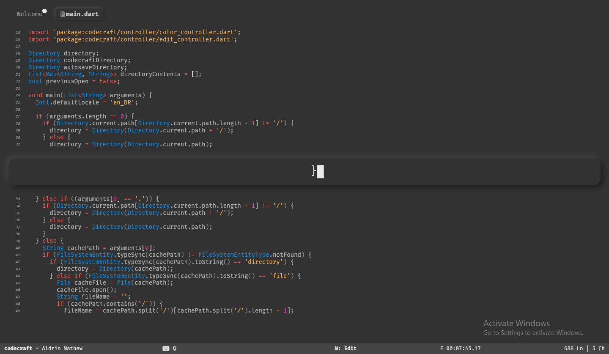

Welcome to **codecraft**, a simple code editor that helps you to focus on lines that matter.

> **This project runs entirely on donations. Consider a donation if this project proves to be useful to you.**

## Supports Syntax Highlighting

This project was started by Aldrin Mathew 2 months after he started learning flutter. He has a **No AD and no Microtransactions policy**, so this is free forever. Consider donating if you can to help and support development.

## Features

- Single line on focus - no distractions.
- Rest of the code displayed on the background for reference.
- Keyboard focused editing. Keep your hands close to your keyboard for super speed.
- Simple UI.
- Dark Mode for less eye strain and increased productivity.